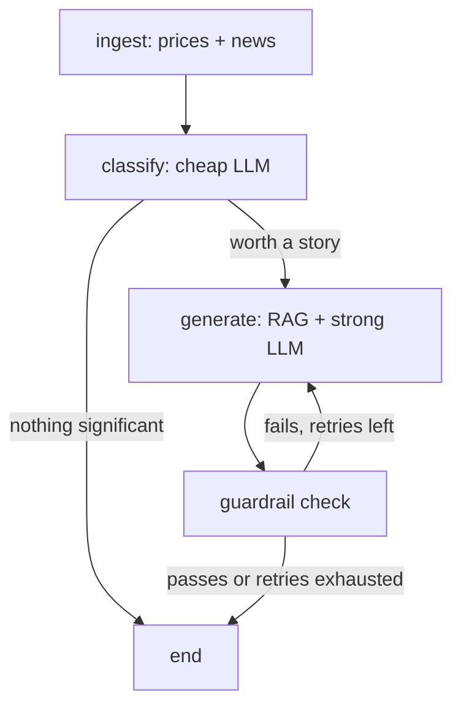

# MarketSense

An AI agent that explains why Nifty 50 stocks moved today — grounded in real price data, real news, and retrieved reference material, not model guesswork.

Built as a hands-on learning project to go deep on production AI-engineering patterns: agent orchestration, RAG, automated guardrails, cost-aware model routing, and semantic caching — not just "call an LLM."

**Not investment advice.** MarketSense explains price moves; it never recommends buying, selling, or holding anything.

## What it does

Every day, MarketSense:
1. Fetches EOD price/volume data for all ~48 Nifty 50 stocks and recent market news headlines.
2. Uses a cheap, fast LLM to filter out noise and flag which price moves are actually significant.
3. Retrieves relevant financial-concept context via RAG (ChromaDB + sentence embeddings).
4. Generates a short, grounded explanation for each significant mover using a stronger LLM.
5. Runs every generated story through automated guardrails (blocks investment-advice language and hallucinated numbers), retrying up to twice before falling back to a safe message.
6. Caches generations semantically, so near-identical situations (e.g. -2.6% vs -2.7%) reuse a cached story instead of paying for a fresh LLM call.

Results are served through a FastAPI backend to a Next.js dashboard: a top-movers chart, and a sortable/filterable table where each row expands to show the classifier's own reasoning.

## Architecture



A scheduled job runs this graph once a day and saves the result; the API serves that saved result instantly (~0.1s) instead of re-running the full pipeline on every request.

## Engineering highlights

- **Agent orchestration:** LangGraph state machine with conditional routing and a genuine bounded retry loop, not a linear script.
- **RAG:** paragraph-level chunking with a heading-merge heuristic, sentence-transformer embeddings, ChromaDB similarity search.
- **Guardrails:** automated post-generation checks (regex-based advice-language detection, numeric hallucination detection against real price data) — prompt instructions alone aren't trusted.
- **Cost engineering:** two-tier model routing (`llama-3.1-8b-instant` for classification, `llama-3.3-70b-versatile` for generation) plus a semantic cache — measured ~22x latency reduction on cache hits (1.35s → 0.06s), zero LLM tokens spent on repeat situations.
- **Production pattern:** scheduled batch pipeline + cached-result API, not live generation per request.

## Tech stack

Python · LangGraph · Groq · ChromaDB · sentence-transformers · FastAPI · Next.js · React

## Project structure

```
data/         price/news ingestion (yfinance, RSS)
agent/        LangGraph state, nodes, classification, generation, guardrails, cache
rag/          knowledge base, chunking, embeddings/vectorstore
api/          FastAPI backend
scripts/      scheduled daily pipeline run
frontend/     Next.js dashboard
```

## Running it locally

**Backend:**
```bash
python -m venv venv
venv\Scripts\Activate.ps1        # Windows PowerShell
pip install -r requirements.txt
cp .env.example .env             # fill in GROQ_API_KEY at minimum
python -m scripts.run_daily      # generates data/latest_run.json
uvicorn api.main:app --port 8000
```

**Frontend:**
```bash
cd frontend
npm install
cp .env.local.example .env.local
npm run dev
```

Visit `http://localhost:3000`.

## Known limitations

- Nifty 50 constituents are hardcoded (index membership is rebalanced by NSE a couple of times a year, so this can drift slightly out of date).
- News headlines are general market news, not pre-matched per ticker — the generation prompt relies on the LLM to judge relevance itself.
- LangSmith tracing is wired in but currently blocked by an external account-side 403 on trace ingestion, unrelated to this code.
